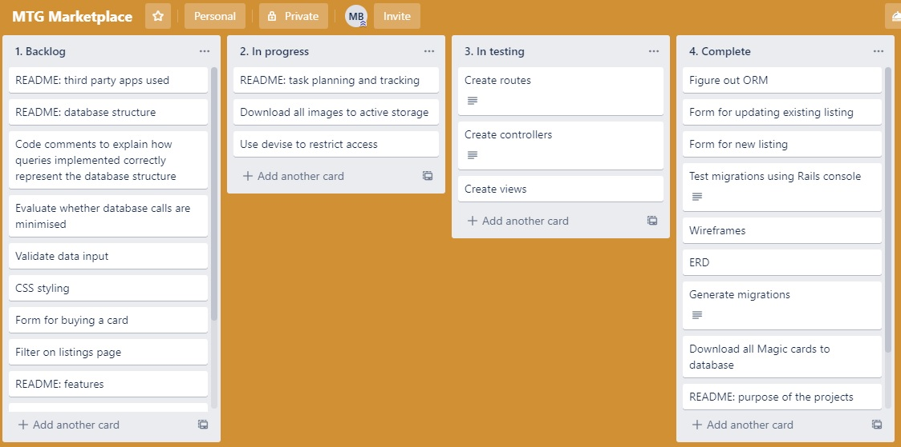

# MTG-marketplace

Github: https://github.com/Mark-Ball/MTG_rails_app

Website: https://mtg-marketplace.herokuapp.com/

# Introduction
Magic: The Gathering ('Magic') is a strategy game played with specially-printed cards. An example of a front and back of a Magic card is presented below.

<strong>Figure 1. Magic card front and back</strong>

The game represents a battle between wizards called Planeswalkers in the in-game universe. A typical game involves playing creatures and spells to attack the opponent and the winner is the player who reduces their opponent's life to zero first.

Magic cards can be bought from games retailers such as EB Games or Goodgames, as well as larger retailers who carry games such as Target. 

## What is the problem we are trying to solve with MTG-marketplace?

Magic cards are usually bought in one of two ways:
- pre-built decks, or
- booster packs

Pre-built decks are designed to give new players to the game a legal deck which they are able to pick up and begin playing with immediately, without modifications. However, these decks are generally inferior compared to the best constructed decks. The problem of inferiority is solved by the second method: buying booster packs.

Booster packs are packages of 15 cards from a given set. Each booster pack will contain 1 rare or mythic rare (i.e. the highest quality, rarest, and generally most powerful cards), 3 uncommon cards, and the remainder common cards. It is through acquiring additional cards, especially the more powerful rare and mythic rare quality cards that the player improves the power of their deck.

Booster packs are available for around $7.00.

The problem with buying booster packs is that many of the cards are poor quality, or may be in colours which the player does not intend to use in their deck. The fact that booster packs are sealed in opaque wrapping means that the buyer cannot know whether they will receive the cards they want in advance of buying the booster pack.

This uncertain outcome is essentially gambling, which can lead to addictive buying behaviour.

The primary market for Magic cards is monopolistic as Magic is the intellectual property of Wizards of the Coast and therefore they enjoy the exclusive right to print Magic cards. Under a monopoly, the price of Magic cards is elevated relative to a competitive market, which is beneficial to the monopolist, but detrimental to consumers.

The development of a secondary market for Magic cards introduces economic competition to the market. This has the effect of reducing price, which is beneficial for the players of Magic, but detrimental to Wizards of the Coast. Furthermore, the existence of a secondary market is likely to reduce the demand for booster packs as players have an alternative way to obtain the cards they desire.

MTG-marketplace allows players to buy specific cards, bypassing the regular card-acquisition cycle of buying booster packs, opening the packs to find that the desired card was not included, and then buying more. The advantages are the following:
- less gambling behaviour
- ability to construct the deck desired with certainty (i.e. without being exposed to the uncertainty of buying booster packs)
- ability to know in advance how much money a desired deck will cost to construct
- ability to sell cards which the player has acquired but does not wish to play themselves, reducing the total cost of developing a collection
- improving efficiency and reducing waste in the Magic card system by transferring cards from those who do not want their cards to those who would like them

## User stories

User stories and their implications for the features of MTG-marketplace are provided below.

<strong>1. As a player, I want to be able to buy individual Magic cards, so I don't have to gamble on booster packs</strong>

Implication: users should be able to view the details of individual cards before purchase, rather than buying without knowing the identity of the card

<strong>2. As a player, I want to be able to sell cards I don't use, so that I may recoup some of my costs</strong>

<strong>3. As someone who no longer plays Magic, I want to be able to sell my old cards, so I may recoup some of my costs</strong>

Implication: users should be able to list cards for sale on the website.

<strong>4. As a buyer, I want to be able to search all listings, so I may find the individual card I need</strong>

Implication: search functionality for listings should exist.

<strong>5. As a seller, I want to be able to see the prices that a card is selling at, so that I may set an appropriate price</strong>

Implication: as much detail on transaction prices should be provided as possible. Ideally this would include a price history over several months. However considering the scope of the project, the feature to be implemented is that users can see the prices of all cards currently listed.

<strong>6. As a seller, I want to be able to modify my listing after it is posted, so that I may correct any mistaken details I have entered</strong>

Implication: edit functionality should exist to change details of the listing, or even remove the listing completely.

<strong>7. As someone speculating on Magic cards without actually playing, I want to be able to see the prices that cards are selling at, so that I may identify an opportunity for profit</strong>

Implication: all visitors to the website should be able to view the listings without having to register on the site.

<strong>8. As both a buyer and a seller, I want the site to handle payment, so I don't have to worry about it</strong>

Implication: a reputable third-party payment gateway such as Stripe should be used on the site. 

<strong>9. As a buyer, I want to be able to enter my delivery details once, so that I may save time on multiple transactions</strong>

Implication: a user should have a persistent profile where information is automatically pulled from when necessary.

<strong>10. As a seller, I want the website to identify the full card information with as little input from me as possible, so I don't have to manually enter all the details myself</strong>

<strong>11. As a buyer, I want the website to check that the details of all cards listed for sale are correct, so I am protected from fraud</strong>

Implication: the website should ask sellers only for the minimum information required to uniquely identify a card, then retrieve the details of each card from a database, rather than asking sellers to enter all the details. This makes the experience easier on sellers as they need to enter less information, and protects buyers because listing details cannot be falsified.

<strong>12. As a user, no one should be able to edit my profile or buy or sell under my profile, so I have control over my activity on the site</strong>

<strong>13. As a seller, no one should be able to edit my listings but me, so I have control over what I am selling</strong>

Implication: an authentication system must exist which restricts users from accessing or editing certain information.

## Wireframes

Wireframes were developed for three classes of device: desktop, iPad, and smartphone. These wireframes represent the planning at the outset of the project. During the project some features had to be cut and as a result the wireframes provided below do not necessarily correspond 100% with the final pages of the website.

<strong>Figure 2. Wireframes for home page</strong>

<strong>Figure 3. Wireframes for listings page</strong>

<strong>Figure 4. Wireframes for show page</strong>

<strong>Figure 5. Wireframes for buy page</strong>

<strong>Figure 6. Wireframes for profile page</strong>

<strong>Figure 7. Wireframes for my_listings page</strong>

## The components of the application

MTG-marketplace is written using Ruby on Rails and the PostgreSQL database. The application utilises the model-view-controller (MVC) model to create separation of concerns and applies a RESTful API to define which methods are available on which endpoints.

This section will explain the different high-level abstractions in the app:
- database
- routes
- model
- view
- controller

#### The database

The role of the database is to hold the data. This is necessary so that data is persistent between sessions. Without a database, information can only be saved in variables, which are temporary memory storage. This means that when a user closes the app and re-opens it, their data would be lost. Data is saved in the database in rows and columns. A page of rows and columns, analogous to a spreadsheet is called a table. Some of the tables included in MTG-marketplace are cards and users, which store information regarding cards and users respectively. The columns within a database are called attributes and the rows are called records.

#### Routes

Routes are important for the rails application because they direct where information should flow between the models, controllers, and views, and which HTTP verbs are available on which endpoints. The routes are arranged in rails using RESTful API architecture.

Routes are declared in the 'routes.rb' file in the config directory. The verbs, controllers, and methods declared in the routes file determines which controllers, methods within those controllers, and views must be created.

#### The model

The database is accessed via the model, which has the responsibility of interfacing with the database and passing the information along to the controller. In Rails, the model must be named the singular version of the table to which it refers. For example the model for the cards table must be called 'cards.rb' by convention and placed in the app/models directory. The model should inherit from the ApplicationRecord class.

If these conventions are met, many instance and class-instance methods are made available on the Cards class. Some methods available on the class itself are the ability to create (.create) or view all instances of the class (.all). Some methods available on an instance of the class are to edit (.update) or destroy (.destroy).

#### The view

The role of the view is to display information to users. Therefore each webpage will have a view. Views are intended to contain very little logic, with only simple conditionals being acceptable. For example the view may contain a conditional to show a 'login' button if the user is logged out, but a 'logout' button if the user is logged in.

By convention, views are saved in the apps/views directory, and then inside another directory with the name of that page's controller. For example if the model was called 'card.rb', the controller would be called 'cards_controller.rb' and a directory named 'cards' would need to be created in apps/views, then any pages accessed through 'cards_controller.rb' would be saved in app/views/cards. These files would then have the name of the methods within the controller. Following on from our example, if there was a method called 'show' in 'cards_controller.rb', the view would be called 'show.html.erb'.

#### The controller

The controller contains the logic of the program and is responsible for connecting the model and view, meaning showing the information retrieved from the database to the user.

By convention, controllers are saved in app/controller and must be named with the plural of the model it interfaces with. For example if the model is called 'card.rb', the controller would be called 'cards_controller.rb'. In this file, a class called CardsController should be declared, which inherits from ApplicationController. Naming the controller using this convention allows access to inherited methods and helpers.

In MTG-marketplace, common tasks performed by the controller are passing information regarding groups or individual cards to the relevant views so that they may be displayed to the user. 

## The database structure

MTG-marketplace uses the PostgreSQL database for the persistent storage of data. The following tables are included:
- users
- addresses
- listings
- cards
- purchases
- active_storage_blobs
- active_storage_attachments

For all tables, the attributes collected can be viewed in the ERD diagram in the following section. 

The users table exists to store information regarding individual buyers and sellers on the site. This table was created using the Devise gem and the majority of the columns are those provided by default.

The addresses table exists to store the postage address of each user so that sellers know where to send any purchased cards. Addresses are associated with users using a foreign key.

The relationship between users and addresses is:

- <strong>an address belongs to a user
- a user has one address</strong>

The listings table holds the details of all cards listed on the website. The table contains foreign keys for both the users and cards tables.

The relationship between users and listings is:
- <strong>a listing belongs to a user
- a user has many listings</strong>

The cards table exists to hold all the information for all Magic cards in the most recent set, Throne of Eldraine. The scope was limited because of hosting limits on Heroku, which only permits 10,000 records in the free tier. 

The reason this table was created was that magicthegathering.io, which is used to retrieve records of individual cards, was created as a hobby project by an individual programmer. Therefore the reliability of the service is uncertain. To mitigate this, the Magic cards required have been downloaded to our own database. This improves both the query speed because we will no longer be waiting for responses from an API, and reliability since we are are hosting the database ourselves.

The relationship between cards and listings is:
- <strong>a listing belongs to a card
- a card has many listings</strong>

The purchases table exists to hold information about which cards have been sold. This table holds foreign keys for both the listings and users tables and will also contain the purchase id created by Stripe.

The relationship between purchases and users is:
- <strong>a purchase belongs to a user
- a user has many purchases</strong>

The relationship between purchases and listings is:
- <strong>a purchase belongs to a listing
- a listing has one purchase</strong>

The last tables in the database structure are the active_storage_blobs and active_storage_attachments. The purpose of these tables is to store images which may be associated with either users or cards, meaning that the relationship is polymorphic. Active_storage_blobs contains the information on the image, such as its name and size in bytes. Active_storage_attachments contains the information that links these images to other tables. It does this by including a record column, which contains the name of the table the image is associated with. In our app, this will be either users or cards. Secondly it contains a record_id column which specifies which record the image is associated with. Record and record_id together identify the table and id which the image is associated with.

The relationships between users, cards, and images are:
- <strong>a user has one attached image
- a card has one attached image</strong>

## ERD

Note: all tables have either a created_at, updated_at, or both columns which are automatically recorded. These have been excluded from the diagram.

<strong>Figure 8. MTG-marketplace ERD.</strong>

## Sitemap

<strong>Figure 9. MTG-marketplace sitemap</strong>

## Features

MTG-marketplace has the following features, which were developed based on the user stories above.

- Users can buy and sell Magic cards
- Anyone can view the listings, including the price and condition of individual listings
- Anyone an search the listings for a specific card
- The prices of all listings of the same card are displayed on the show page for that card
- Users can edit or delete listings
- A profile section allows users to save their information on the site
- Security has been added to prevent users from editing or deleting listings which are not theirs, and accessing profiles which are not theirs
- When listing a new card for sale, users can search a database of cards to fill their listing, rather than fill in all that information themselves
- Secure payment through Stripe

## Target audience

The target audience for MTG-marketplace is Magic players who either want to increase their collection without buying booster packs or make money selling cards.

Additionally, the site may be of interest to non-players who are interested in speculating on an asset market and see an opportunity for profit in trading Magic cards or as a store of value.

## Third-party services MTG-marketplace uses

The following third-party services were used either in the development or the running of MTG-marketplace:
- magicthegathering.io
- Down gem
- HTTParty gem
- Devise gem
- Stripe and stripe gem
- Ultrahook and ultrahook gem
- Amazon S3
- PostgreSQL
- Heroku

#### magicthegathering.io

magicthegathering.io is an API developed by Andrew Backes, a software engineer from Milwaukee, Wisconsin. This API is developed as a hobby project by Backes, and is not affiliated with the organisation which owns Magic, Wizards of the Coast.

This API was used in MTG-marketplace to download a database of all existing Magic cards into our own table in postgres. This was a significant time-saver because over 45,000 unique Magic cards exist and producing a database of all these cards for the purpose of this project would have been impossible.

It is important to have a database of all Magic cards for this projects so that users may more easily identify the cards they wish to buy or sell. The alternative would be for sellers to input the information about each Magic card they choose to list. However, the problem with this is that sellers may falsify information, leading buyers to believe that a card is more powerful than it really is, or simply mistakenly enter incorrect information.

magicthegathering.io provides endpoints for groups of cards (this is the main endpoint which was used for MTG-marketplace), individual cards, all sets, individual sets, the content of booster packs, a list of card types (e.g. creatures, land, sorcery) and more. The API is rate-limited to 5,000 requests per hour. 

Having a pre-existing database of all Magic cards which is used to provide information about each card sold on MTG-marketplace solves this problem as well as leading to an easier experience for sellers.

#### Down gem

Down is a Ruby gem used for downloading files. In MTG-marketplace, Down was used to download images of Magic cards. The url for each download was sourced from the cards downloaded from magicthegathering.io and a script was written in Ruby which downloaded the image from each url, then associated the image with the correct card via the ORM and saved the image in the database.

The result was that active_storage_blobs stored each image and active_storage_attachments saved the association between that image and the correct card.

The only use of Down was to seed the database, although in future Down will be used when new sets are released to download the images for those new records.

#### HTTParty gem

HTTParty is a gem used to send http requests programmatically. It was used in this application to repeatedly send 'get' requests to the magicthegathering.io API to download records of cards to our database.

#### Devise gem

Devise is a Ruby gem which provides a flexible authentication solution. In MTG-marketplace, Devise was used to generate the users table in the database, user model, controllers (not in the rails files), and views relating to signing in, registering, and resetting passwords.

One of the most important functions of Devise is to make the 'current_user' variable available, which makes it much easier to attach other objects such as listings, addresses, and images to a specific user. 'current_user' can also be used to display different information to different users depending on which user is logged in.

#### Stripe

Stripe is the payment system used in MTG-marketplace. When users confirm they want to purchase a listing they are redirected to Stripe to enter their credit card details. Once successful they are redirected back to the application, to a page specially set up to congratulate them on their purchase.

The payment processing also integrates webhooks, meaning that the purchase will only be entered into the purchase table once confirmation has been received from Stripe that the checkout was successful.

#### Ultrahook

Ultrahook is a an application which allows our application to receive a HTTP requests made over the public internet. This is necessary because in development we test our application on localhost:3000, which is not an accessible endpoint from the wider internet. Ultrahook provides a solution, which allows us to set up an endpoint which transmits any HTTP requests to our ultrahook address to our localhost:3000.

This is important for development environments where we will be developing from behind a firewall, not from a publically accessable endpoint. Once the application is deployed using cloud hosting, ultrahook will no longer be used.

#### Amazon S3

Amazon Simple Storage Service is a cloud-based storage service designed to make web-scale computing easier for developers. Amazon S3 works by creating a 'bucket' on Amazon web services which files can be uploaded to. MTG-marketplace uses S3 to host the majority of the images used on the site.

S3 was used because the number of images that will need to be hosted for this web application is unknown for two reasons:
- users may upload profile images
- additional sets of Magic cards will require image hosting.

This meant that local hosting was no longer the optimal solution due to the unpredictabilty of the amount of storage required.

#### PostgreSQL

PostgreSQL was the databased used for MTG-marketplace. PostgreSQL is a free, open-source, relational database. PostgreSQL can be easily integrated with a rails application when the application is created by typing.

>rails new project_name -d postgresql

#### Heroku

The application is hosted using the cloud hosting provider Heroku. Heroku provides instructions for how to deploy a rails application on the platform, making the deployment easy for the purpose of this project. Lastly, Heroku can also be synchronised with the repo on github, which allows any updates pushed to github to be immediately reflected on the website hosted using Heroku.

## Tech stack

The following were used in the creation of MTG-marketplace:
- Ruby
    - Gems: Down, Devise, Stripe, ultrahook, HTTParty, aws-sdk-s3
- Rails
- Postgres database
- HTML
- CSS
- Javascript
- Heroku
- Amazon S3

## Task planning and tracking

Tasks were tracked using trello (see Figures 10-15 below) and planned by considering the dependencies of each feature on other features.

#### Stage 1. Planning

The first tasks completed were those involved in the planning stage of the project, including:
- Why is this a problem that needs solving?
- User stories
- Wireframes
- ERD
- relationships between tables

Each of these steps of the project were completed before the rails project was even created. These features were completed first in the order listed above because the features of the website, and the database structure serve as the foundation for all other parts of the project.

#### Stage 2. Developing the database

In this stage, code was written for the following:

- generating the database migrations
- writing the associations into the models

#### Stage 3. Seeding the database

The major step of this stage of the project was to seed the cards table with all Magic cards in existance. Although this was accomplished, in the final version of the project, only the records of the most recent set, Throne of Eldraine, were downloaded ot the database.

This was done for two reasons:
1. the time taken to download all the images related to the cards was prohibitively long (estimated 25+ hours)
2. Heroku limits records to 10,000 in the free tier, whereas the entire database of Magic cards was over 45,000 records

In this stage, the database relations are validated using rails console to make sure that the ORM commands which should be available are functioning.

Testing involved making sure the following were possible:
- a user could be created
- an address could be associated with a user
- a listing could be created
- a listing could be associated with a card and a user
- an image could be associated with a card
- a purchase could be created
- a purchase could be associated with a user and a listing

#### Stage 4. Basic features

Once the project has passed all testing for the ORM, the next priority was the development of basic CRUD functionality for listings and users.

This involved the creation of routes, controllers, and views.

#### Stage 5. Security features

After basic CRUD functionality was implemented, it was important to implement security to ensure:
- users cannot edit or delete listings which are not theirs
- users cannot edit or delete listings which have been purchased
- users cannot access or edit profiles which are not theirs

Security features were implemented by providing logic in the controller, as opposed to the view, which can be easily modified by anyone viewing the website to send fraudulent information to the website.

Users were prevent from editing listings which are not theirs by comparing their user id to the listing owner's id. If these did not match, the user is redirected to the listings page.

Similar functionality was implemented to prevent editing or deleting purchased listings. If a user attempts to access the edit page of a listing, it is checked to see if the listing's id is present in the purchases table. If it is then we know that listing has been purchased, and the user is redirected to the listings page.

User were prevented from accessing other users's profile page because the profile page always loads information related to the current_user given by Devise. Therefore no user can ever see a profile (or access the edit functionality) that is not theirs.

#### Stage 6. Advanced features

Once basic features were complete, the next stage was to add advanced features, including:
- search
- payment

These features were left until later in the project as they were features which could be cut if there was no time to develop them, but they were in the original plans. Both of these features are present in the final version of MTG-marketplace, but the search functionality is significantly simpler than what was originally planned.

Search was implemented by using a form to send params to the controller, which would then redirect back to the same page. There was then code on the view to display certain information only if there were params which corresponded to the search.

Payment was implemented by redirecting the user to Stripe to enter their credit card information. Once the checkout session on Stripe was completed, webhooks were implemented to ensure that the purchase would only be recorded in the database once confirmation had been received from Stripe that the payment information was valid.

#### Stage 7. Polish

Polishing the website only took place once all core functionality, including advanced features were working correctly. Polish included:
- styling with CSS
- attempting to reduce the number of database queries using eager loading
- DRYing up the controllers by creating instance methods in the models

#### Trello
Screenshots of the Trello board used to track progress through the project are provided below.

<strong>Figure 10. Trello board at beginning of Day 1</strong>

<strong>Figure 11. Trello board at end of Day 2</strong>

<strong>Figure 12. Trello board at end of Day 5</strong>

<strong>Figure 13. Trello board at end of Day 8</strong>

<strong>Figure 14. Trello board at end of Day 12</strong>

<strong>Figure 15. Trello board at end of Day 14</strong>